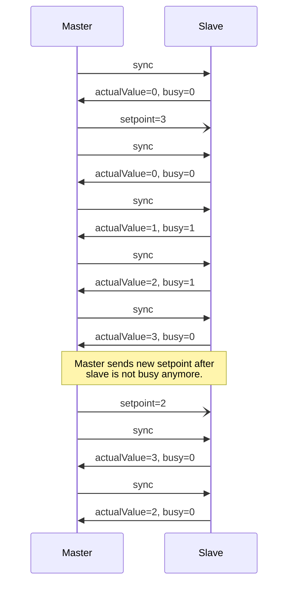

# Setpoint Example

The setpoint example demonstrates sync based CANopen communication. In this example are two nodes involved, the sync producer and the sync consumer. In the following text the sync producer is called master and the consumer is called slave.

The master starts producing sync messages (COB-ID 0x80). Once the slave is up and running it will answer the sync message with a synchronous PDO (COB-ID 0x181) containing the actual position and a busy flag. The master sends a new random setpoint once the slave is not busy anymore with the means of an event-driven PDO (COB-ID 0x180). This PDO contains the new setpoint. The slave increments or decrements its actual value until the setpoint is reached. Upon every sync message from the master, the slave will report the current actual value and the current status.  




The traffic on the CAN-bus captured with the candump tool looks as following.
```bash
can0  701   [1]  00
can0  080   [0] 
can0  080   [0] 
can0  080   [0] 
can0  702   [1]  00
can0  080   [0] 
can0  181   [5]  00 00 00 00 00
can0  180   [4]  03 00 00 00
can0  080   [0] 
can0  181   [5]  00 00 00 00 00
can0  080   [0] 
can0  181   [5]  01 00 00 00 01
can0  080   [0] 
can0  181   [5]  02 00 00 00 01
can0  080   [0] 
can0  181   [5]  03 00 00 00 00
can0  180   [4]  02 00 00 00
can0  080   [0] 
can0  181   [5]  03 00 00 00 00
can0  080   [0] 
can0  181   [5]  02 00 00 00 00
can0  080   [0] 
can0  181   [5]  02 00 00 00 00
```

## Running the example
Open three terminal windows to run candump, the master and the slave as following.

Terminal 1

```bash
candump can0
```

Terminal 2

```bash
./bin/setpoint/setpoint-master can0
```

Terminal 3

```bash
./bin/setpoint/setpoint-slave can0
```
